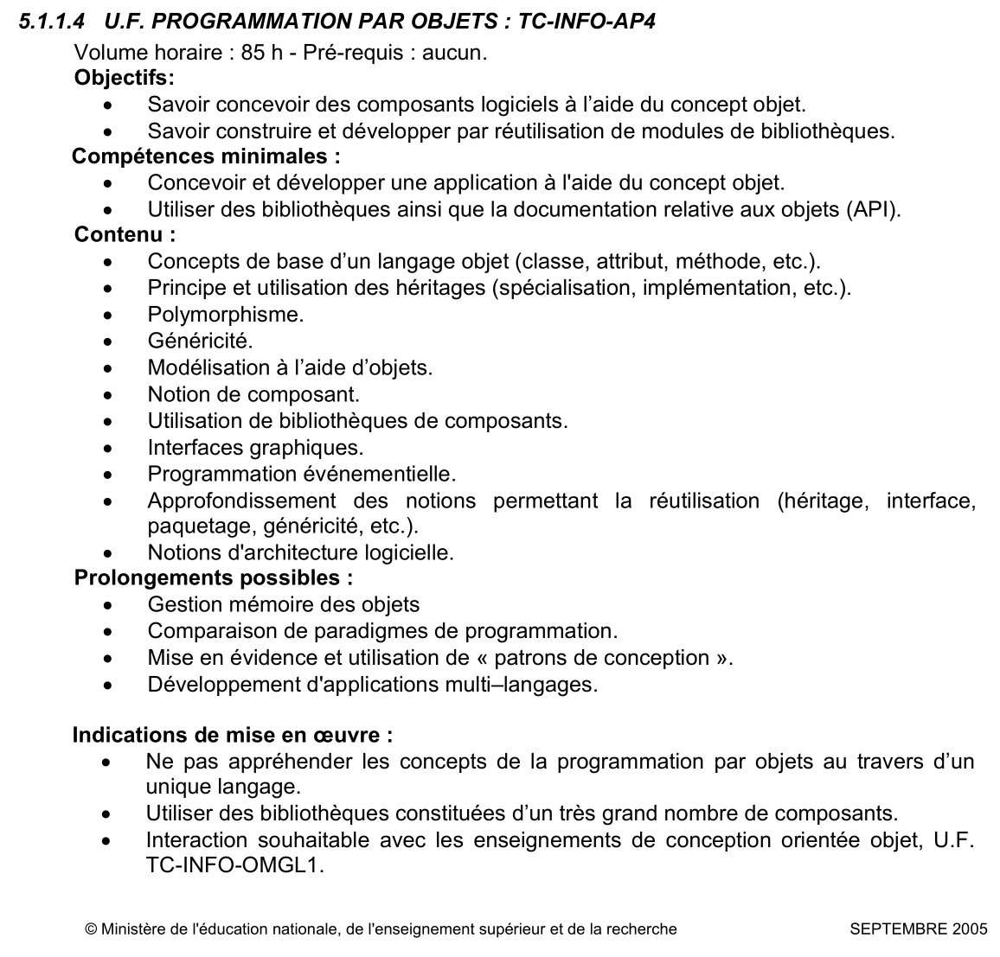

# Apprendre les bases en Java à l'aide du fil rouge *Cabinet Medical*
<!-- => retour à la ligne, 2 espaces .... -->

Vous trouverez ici les énoncés de TD/TP créés pour le [module AP4 du PPN du DUT Informatique de 2005](#AP4_DUT2005).  
Ils contiennent des exercices de base et un fil rouge autour d'un use case **Créer un patient** pour un **Cabinet Medical**.  
Ils vous permettront de découvrir les bases de la Programmation Orientée Objet et d'apprendre les bases du langage Java.

Ces supports ont été utilisés de 2006 à 2012 par les étudiants de deuxième année du DUT Informatique de l'IUT du Limousin.  
A chaque étape, commencez par le TD et continuez par le TP.

Alors nostalgique du Cabinet Médical ou non, have fun !

* TD JAVA n°1: Introduction à Java, Classe et Objet => [TD1_Java.pdf](TD1_Java.pdf)  
TP JAVA n°1: Prise en main d’Eclipse => [TP1_Java.pdf](TP1_Java.pdf)

* TD JAVA n°2: Héritage et Polymorphisme => [TD2_Java.pdf](TD2_Java.pdf)  
TP JAVA n°2: Héritage et Polymorphisme => [TP2_Java.pdf](TP2_Java.pdf)
  

* TD JAVA n°3: Interfaces, Exceptions => [TD3_Java.pdf](TD3_Java.pdf)  
TP JAVA n°3: Interface, Exceptions, Vector => [TP3_Java.pdf](TP3_Java.pdf)

* TD JAVA n°4: Collection et Généricité => [TD4_Java.pdf](TD4_Java.pdf)  
TP JAVA n°4: Collection et Généricité => [TP4_Java.pdf](TP4_Java.pdf)

* TD JAVA n°5: E/S en JAVA : Sérialisation => [TD5_Java.pdf](TD5_Java.pdf)  
TP JAVA n°5: E/S en JAVA => [TP5_Java.pdf](TP5_Java.pdf)

* TD JAVA n°6: Tutoriel log4j : A propos de le journalisation => [TD6_JavaTutorielLog4j.pdf](TD6_JavaTutorielLog4j.pdf)

* TP JAVA n°6: Tutorial pour la mise en place d’une application interactive
en mode console (notions d’architecture logicielle)  
Version complète => [TP6_JavaDaoDto.pdf](TP6_JavaDaoDto.pdf)  
Version *roadmap* => [TP6_JavaDaoDtoRoadMap.pdf](TP6_JavaDaoDtoRoadMap.pdf)

* TD JAVA n°7: Interface Graphique (Swing) => [TD7_Java.pdf](TD7_Java.pdf)   
TP JAVA n°7: Interface Graphique => [TP7_Java.pdf](TP7_Java.pdf)

* TD JAVA n°8: Interface Graphique - Dessiner en Java => [TD8_Java.pdf](TD8_Java.pdf)   
TP JAVA n°8: Dessiner en Java - enum - Gestion des événements - JTable => [TP8_Java.pdf](TP8_Java.pdf) 

* TD JAVA n°9: Les applets en Java => [TD9_Java.pdf](TD9_Java.pdf)   
TP JAVA n°9: Les applets en Java => [TP9_Java.pdf](TP9_Java.pdf) 

* TD JAVA n°10: Persistance des Objets avec JDBC => [TD10_Java.pdf](TD10_Java.pdf)    
TP JAVA n°10: Persistance des Objets avec JDBC => [TP10_Java.pdf](TP10_Java.pdf)

* TD JAVA n°11: Compléments persistance des objets (fichier properties et présentation fabrique de DAO) => [TD11_Java.pdf](TD11_Java.pdf)  
TP JAVA n°11: Compléments persistance des objets => [TP11_Java.pdf](TP11_Java.pdf)  

Et en complément ... 
  
* Programmation JAVA/XML:
	* Découverte des API SAX & JAXP => [Tutoriel_JavaXML1.pdf](Tutoriel_JavaXML1.pdf)
	* Prise en main de l'API JAXB (une partie sur le cabinet médical) => [Tutoriel_JavaXML2.pdf](Tutoriel_JavaXML2.pdf)
* Programmation Java/JSON avec Jackson => [Tutoriel_JavaJSONJackson.pdf](Tutoriel_JavaJSONJackson.pdf)

## Annexe : Extrait Module AP4 Programmation par Objets - PPN (Programme Pédagogique National) DUT Informatique (2005) 

Une nouvelle version du PPN (Programme Pédagogique National) pour le DUT Informatique a été adoptée en 2013. Son nouveau contenu peut être consulté [ici](http://www.iut-orsay.u-psud.fr/_resources/Formations/PPN-Informatique.pdf). 

Ces documents sont diffusés sous license Creative Common CC-BY-NC-SA.

